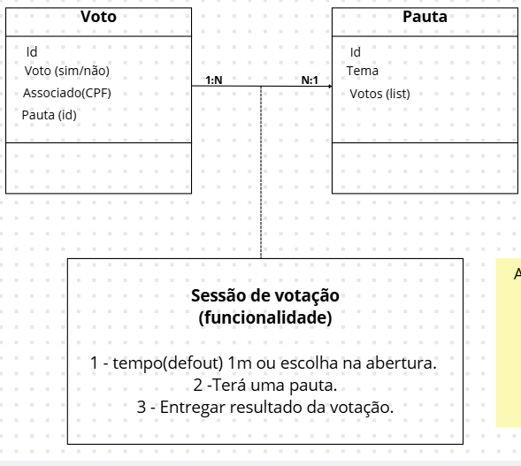
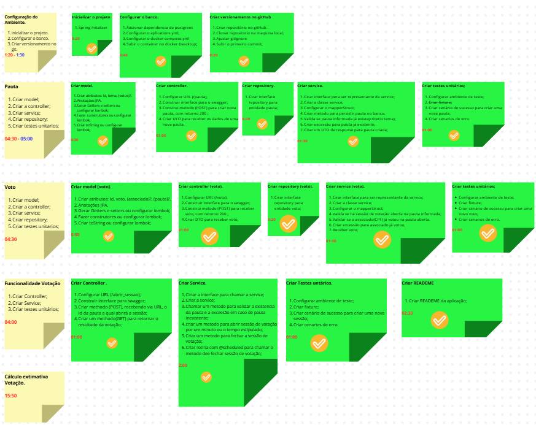

# Desafio Votação - versão II

## Objetivo 01

Esse projeto tem como objetivo primeiro desenvolver as habilidades do programador, para a 
compreensão de como dar inicio corretamente a task para a desenvoltura do projeto, com atenção 
as metodologias agis. Nessa esteira, toda a etapa se *upstream*, que envolve  o desenho do projeto,
a quebra das tarefas e o cálculo do tempo de desenvolvimento para cada task.
---
## Objetivo 02

No cooperativismo, cada associado possui um voto e as decisões são tomadas em assembleias, 
por votação. Imagine que você deve criar uma solução para dispositivos móveis para gerenciar 
e participar dessas sessões de votação.

Essa solução deve ser executada na nuvem e promover as seguintes funcionalidades através de 
uma API REST:

    • Cadastrar uma nova pauta
    • Abrir uma sessão de votação em uma pauta (a sessão de votação deve ficar aberta por um tempo determinado na chamada de abertura ou 1 minuto por default)
    • Receber votos dos associados em pautas (os votos são apenas 'Sim'/'Não'. Cada associado é identificado por um id único e pode votar apenas uma vez por pauta)
    • Contabilizar os votos e dar o resultado da votação na pauta

Para fins de exercício, a segurança das interfaces pode ser abstraída e qualquer chamada para 
as interfaces pode ser considerada como autorizada. A solução deve ser construída em java, 
usando Spring-boot, mas os frameworks e bibliotecas são de livre escolha (desde que não infrinja 
direitos de uso).

É importante que as pautas e os votos sejam persistidos e que não sejam perdidos com o restart 
da aplicação.

O foco dessa avaliação é a comunicação entre o backend e o aplicativo mobile. Essa comunicação 
é feita através de mensagens no formato JSON, onde essas mensagens serão interpretadas pelo cliente 
para montar as telas onde o usuário vai interagir com o sistema. A aplicação cliente não faz 
parte da avaliação, apenas os componentes do servidor. O formato padrão dessas mensagens será 
detalhado no anexo 1, do documento *Avaliação técnica*, 'situado na raiz do projeto.
---
## Tecnologias usadas

* Java 17
* Spring Boot
* Docker 
* MapperStruct
---

## Pré-requisitos

+ Docker instalado da máquina ([link](https://docs.docker.com/get-docker/))
+ Configurar um arquivo *.env* na raiz do projeto, nos seguintes moldes:

```` 
DB_URL=jdbc:postgresql://localhost:<Porta local disponível>/Nome_do_Banco
POSTGRES_DB= Nome_do_Banco
POSTGRES_PASSWORD= senha_do_Banco
POSTGRES_USER=senha_do_usuario
````
-------
## Sobre o banco de dados

* O banco de dados utilizado foi o **POSTGRES**

------
## Como executar o projeto

* Com o **Docker descktop** rodando, no console na raiz do projeto, execute o seguinte comando:

``
docker-compose up --build
``

Com o docker rodando, dê o play na ide.

## Estrutura do projeto

* Classes:
  * Voto { id, voto(Sin ou não), Associado, Pauta};
  * Pauta {id, tema, Lisda de votos};

* Funcionalidades:
  * Abrir a pauta por determinado tempo;
  * Entregar resultado da botação;
---

## Classes relacionadas mais função



---

## Quebra de tarefas



## Endpoits
### Voto

### Pauta
`` POST: http://localhost:8080/pauta``

**Cadastra** uma nova pauta. Recebe um dto *PautaRequestDto*


### Sessão
`` POST: http://localhost:8080/sessao/abrir/{id}``

**Abre uma nova sessão**, recebe o id da pauta que será votada na URL e no corpo da requisição
recebe um JSON (NovaSessaoDto) com o tempo que a sessão ficará aberta;

`` GET: http://localhost:8080/sessao/resultado/{id}``

**Retorna o resultado da pauta** informada, pelo id na URL da requisição;

### Voto

`` POST: http://localhost:8080/voto``

**Cria um novo voto** apartir de um VotoRequestDto, recebido no body da requisição.


##### Projeto no GitHub:  https://github.com/SauloHrodrigues/Desafio_Votacao_V1.git

## Autor:

### Nome: Saulo Henrique Rodrigues

##### LinkedIn: https://www.linkedin.com/in/saulohenriquerodrigues/

##### Swagger: http://localhost:8080/swagger-ui.html
